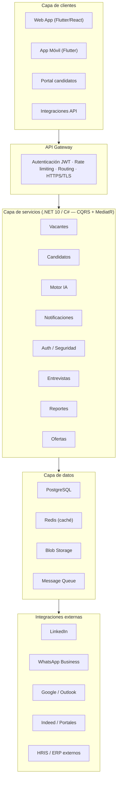
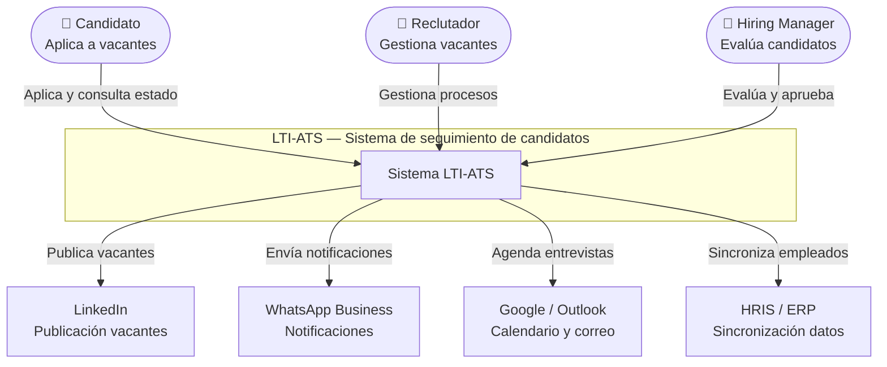
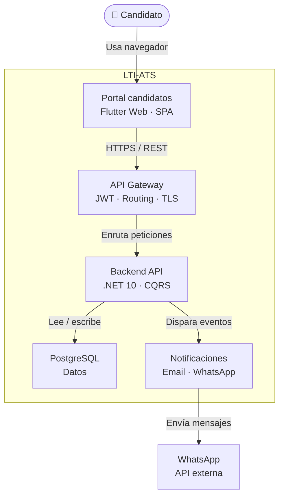
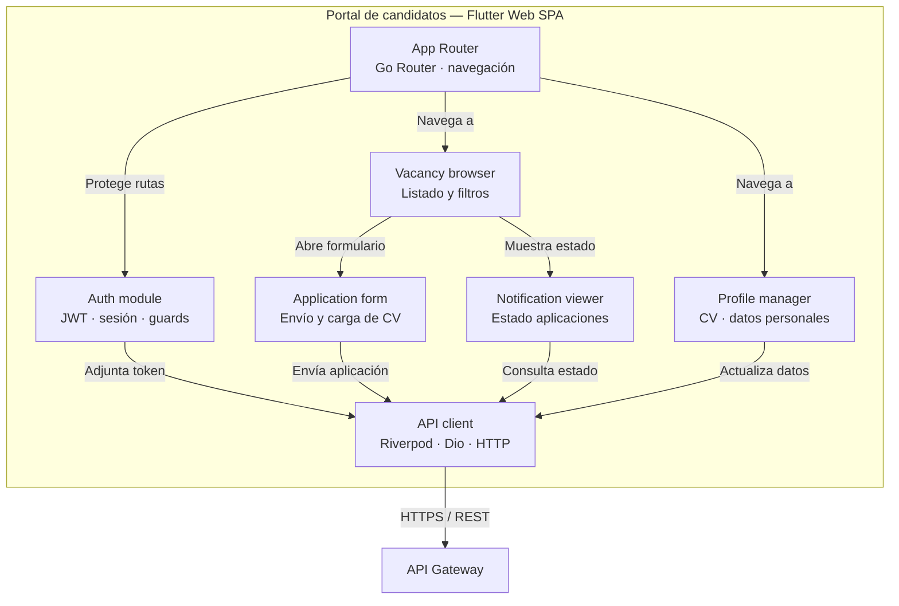
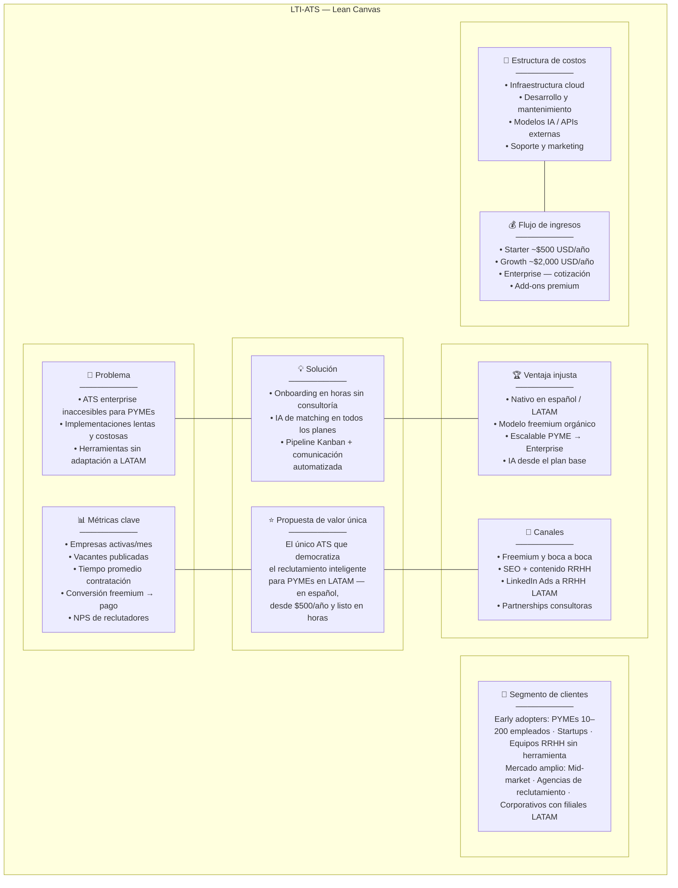
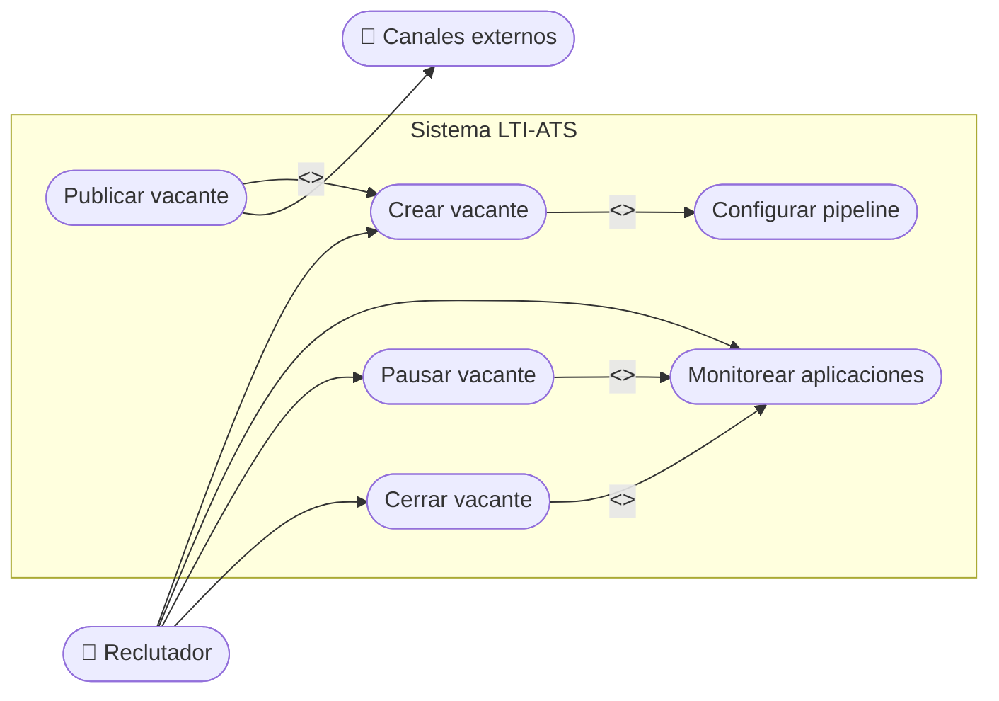
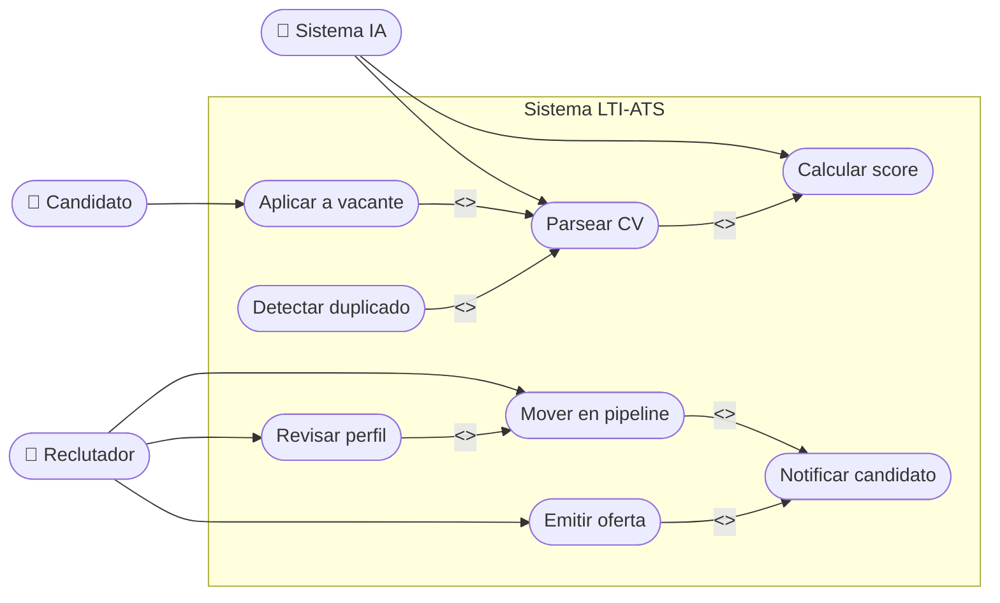
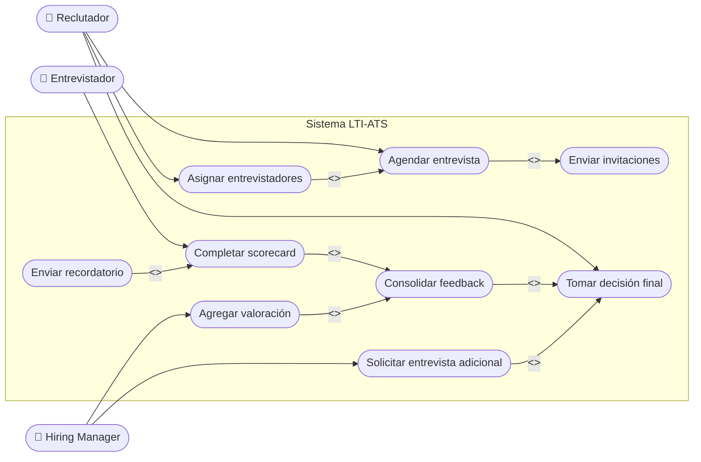

# LTI-ATS
## Sistema de seguimiento de candidatos para empresas que crecen

---

## ¿Qué es LTI-ATS?

LTI-ATS es un sistema de seguimiento de candidatos (ATS) diseñado para democratizar el reclutamiento inteligente. A diferencia de las soluciones enterprise tradicionales, LTI-ATS está construido desde el primer día para ser accesible, rápido de adoptar y escalable — desde una startup de 5 personas hasta un corporativo de miles de empleados.

La plataforma centraliza todo el ciclo de contratación: publicación de vacantes, recepción y filtrado de CVs, gestión del pipeline de selección, comunicación con candidatos y analítica de reclutamiento, todo en una sola herramienta intuitiva y en español.

---

## Valor añadido

### Para las empresas
- **Reducción del tiempo de contratación** gracias al filtrado automático con IA y el matching inteligente de candidatos.
- **Eliminación de barreras de entrada** con un modelo freemium sin necesidad de tarjeta de crédito ni consultoría de implementación.
- **Crecimiento sin migración**: el sistema escala con la empresa, desde el primer proceso de selección hasta operaciones de reclutamiento masivo.
- **Ahorro significativo** frente a soluciones enterprise que pueden costar 10x–300x más por año.

### Para los reclutadores
- Interfaz diseñada para no técnicos, operativa desde el primer día sin capacitación extensa.
- IA incluida en todos los planes: análisis de CVs, scoring de candidatos y sugerencias de redacción de job descriptions.
- Comunicación automatizada con candidatos en cada etapa del proceso.

### Para el mercado LATAM
- Soporte nativo en español con adaptación a normativas laborales y formatos de CV regionales.
- Integraciones prioritarias con herramientas del día a día en la región: WhatsApp Business, Google Workspace y LinkedIn.

---

## Ventajas competitivas

1. **Precio accesible sin sacrificar funcionalidad** — planes desde ~$500 USD/año, diseñados para PYMEs sin renunciar a capacidades avanzadas.
2. **Onboarding en horas, no en meses** — sin necesidad de equipos técnicos ni consultores externos para comenzar.
3. **UX intuitiva para reclutadores no técnicos** — curva de aprendizaje mínima, adoptable por cualquier área de RRHH.
4. **Escalabilidad real** — cubre desde micro-empresas hasta grandes corporativos sin necesidad de cambiar de plataforma.
5. **IA democratizada** — funcionalidades de matching y análisis de CVs disponibles en todos los planes, no solo en los premium.
6. **Nativo en español y contexto LATAM** — idioma, normativas y formatos adaptados al mercado hispanohablante.
7. **Modelo freemium sin fricción** — acceso gratuito limitado que genera adopción orgánica y reduce el riesgo percibido.
8. **Integraciones abiertas con herramientas cotidianas** — WhatsApp Business, Google Workspace, LinkedIn y conectores con ERP populares en LATAM (en desarrollo).

---

## Comparativa frente a la competencia

| Criterio | LTI-ATS | Greenhouse | Workday |
|---|---|---|---|
| **Precio/año** | ✅ Desde ~$500 USD | ⚠️ ~$6k–25k USD | ❌ $150k+ USD |
| **Onboarding** | ✅ Horas, sin consultoría | ⚠️ 1–4 semanas | ❌ 3–9 meses |
| **UX** | ✅ Intuitivo desde el día 1 | ⚠️ Moderna, con curva | ❌ Complejo y denso |
| **Segmento** | ✅ PYME → Enterprise | ⚠️ Mid → Enterprise | ❌ Solo 500+ empleados |
| **IA incluida** | ✅ Todos los planes | ⚠️ Solo planes altos | ⚠️ Sí, costoso |
| **Español / LATAM** | ✅ Nativo | ❌ Limitado | ❌ Parcial |
| **Freemium** | ✅ Sí, sin tarjeta | ❌ No | ❌ No |
| **Integraciones** | ⚠️ En desarrollo | ✅ +500 nativas | ✅ Suite HCM completa |

### Resumen de posición

| | LTI-ATS | Greenhouse | Workday |
|---|:---:|:---:|:---:|
| Ventajas claras | **6** | 2 | 2 |
| Paridad / parcial | **1** | 3 | 2 |
| Desventajas | **1** | 3 | 4 |

---

## Conclusión estratégica

LTI-ATS gana en los 7 factores más relevantes para PYMEs en LATAM: precio, velocidad de adopción, facilidad de uso, cobertura de segmentos, democratización de IA, idioma y modelo de entrada sin fricción.

La única brecha actual es el ecosistema de integraciones, donde Greenhouse lidera con +500 conectores nativos. Priorizar integraciones con **WhatsApp Business, Google Workspace y LinkedIn** cierra la brecha más crítica para el mercado objetivo.

> Workday no compite en el mismo segmento — es overkill para PYMEs y excesivamente costoso para cualquier empresa que no sea un corporativo grande.

---

*Leyenda: ✅ Ventaja · ⚠️ Paridad / parcial · ❌ Desventaja*

---

## Diseño del sistema a alto nivel

LTI-ATS está construido sobre una arquitectura en capas que separa responsabilidades claramente, favorece la escalabilidad horizontal y facilita el mantenimiento independiente de cada módulo. A continuación se describen las cinco capas principales.

### Capa de clientes
Es el punto de entrada de todos los usuarios del sistema. Incluye la web app (Flutter o React), la app móvil (Flutter), el portal público de candidatos y las integraciones vía API para terceros. Todos los clientes se comunican exclusivamente a través del API Gateway — nunca directamente con los servicios internos.

### API Gateway
Actúa como único punto de entrada al backend. Se encarga de la autenticación y validación de tokens JWT, el control de rate limiting para prevenir abuso, el enrutamiento de peticiones hacia el servicio correspondiente y la terminación HTTPS/TLS. Es el guardián de seguridad de todo el sistema.

### Capa de servicios
Implementada en .NET 10 / C# siguiendo el patrón CQRS con MediatR. Cada servicio tiene una responsabilidad única y se comunica con los demás a través de eventos o la capa de datos. Los servicios principales son: Vacantes, Candidatos, Motor IA, Notificaciones, Auth/Seguridad, Entrevistas, Reportes y Ofertas.

### Capa de datos
Gestiona la persistencia y el acceso a la información. Compuesta por PostgreSQL como base de datos principal, Redis para caché y gestión de sesiones, Blob Storage para archivos binarios (CVs, documentos de oferta) y una Message Queue para procesamiento asíncrono de notificaciones y tareas de IA.

### Integraciones externas
Conectores con servicios de terceros: LinkedIn e Indeed para publicación de vacantes, WhatsApp Business y Google/Outlook para comunicaciones, y conectores con HRIS/ERP externos vía API REST para empresas que necesitan sincronizar datos con sus sistemas existentes.

### Diagrama de arquitectura

---

## Diagrama C4 — Portal de candidatos

El modelo C4 describe la arquitectura en 3 niveles de abstracción progresiva, desde la vista más general hasta los componentes internos del portal de candidatos.

---

### Nivel 1 — Contexto del sistema

Muestra el sistema completo LTI-ATS dentro de su entorno: quiénes son sus usuarios y con qué sistemas externos se relaciona.

---

### Nivel 2 — Contenedores (foco: portal de candidatos)

Hace zoom dentro de LTI-ATS y muestra sus contenedores desplegables, resaltando el portal de candidatos y sus dependencias directas.

---

### Nivel 3 — Componentes del portal de candidatos

Hace zoom dentro del portal de candidatos y muestra sus componentes internos, sus responsabilidades y cómo se comunican entre sí.

---

## Lean Canvas

### Problema
- Los ATS enterprise son inaccesibles en precio para PYMEs
- Implementaciones lentas (meses) y costosas sin equipos técnicos dedicados
- Herramientas en inglés sin adaptación al contexto laboral de LATAM

### Solución
- ATS con onboarding en horas, sin consultoría externa requerida
- IA para filtrado y matching de candidatos incluida en todos los planes
- Pipeline Kanban configurable con comunicación automatizada en cada etapa

### Propuesta de valor única
> El único ATS que democratiza el reclutamiento inteligente para PYMEs en LATAM — en español, desde $500/año y listo en horas.

### Ventaja injusta
- Nativo en español con contexto normativo y cultural de LATAM
- Modelo freemium que genera adopción orgánica y boca a boca
- Escalable de PYME a Enterprise sin necesidad de migrar de plataforma
- IA incluida desde el plan base, no como add-on premium

### Segmento de clientes

**Early adopters**
- PYMEs de 10–200 empleados en LATAM
- Startups en etapa de crecimiento
- Equipos de RRHH sin herramienta formal de reclutamiento

**Mercado amplio**
- Empresas mid-market en expansión
- Agencias de reclutamiento
- Corporativos con filiales en LATAM

### Canales
- Freemium y boca a boca (adopción orgánica)
- SEO y contenido especializado en RRHH en español
- LinkedIn Ads segmentado a perfiles de RRHH en LATAM
- Partnerships con consultoras de recursos humanos en la región

### Métricas clave
- Empresas activas por mes
- Vacantes publicadas en la plataforma
- Tiempo promedio de contratación por cliente
- Tasa de conversión freemium → plan de pago
- NPS de reclutadores

### Estructura de costos
- Infraestructura cloud (servidores, base de datos)
- Desarrollo y mantenimiento del producto
- Modelos de IA y consumo de APIs externas
- Soporte al cliente y onboarding
- Marketing y adquisición de nuevos clientes

### Flujo de ingresos
- **Plan Starter** — ~$500 USD/año (PYMEs hasta 50 empleados)
- **Plan Growth** — ~$2,000 USD/año (mid-market)
- **Plan Enterprise** — cotización personalizada (corporativos)
- **Add-ons** — integraciones premium, reportes avanzados, soporte dedicado

---

## Casos de uso principales (UML)

### CU-01 — Gestión de vacantes

**Actores:** Reclutador, Sistema LTI-ATS, Canales externos (LinkedIn, Indeed, portal propio)

**Descripción:** El reclutador crea una vacante, configura el pipeline de selección y la publica en uno o varios canales. El sistema gestiona el estado de la vacante durante todo su ciclo de vida hasta su cierre.

**Flujo principal:**
1. El reclutador inicia sesión y accede al módulo de vacantes
2. Crea una nueva vacante usando una plantilla o desde cero (con sugerencias de IA)
3. Configura las etapas del pipeline para esa vacante
4. Selecciona los canales de publicación y publica
5. El sistema distribuye la vacante a los canales seleccionados
6. El reclutador monitorea aplicaciones entrantes desde el dashboard
7. Al cubrir la posición, cierra la vacante y el sistema archiva el proceso

**Flujos alternativos:**
- El reclutador pausa la vacante temporalmente sin cerrarla
- El sistema notifica al reclutador cuando hay nuevas aplicaciones

---

### CU-02 — Gestión de candidatos

**Actores:** Candidato, Reclutador, Sistema LTI-ATS (IA)

**Descripción:** El candidato aplica a una vacante publicada. El sistema parsea y analiza su CV automáticamente, genera un score de compatibilidad y lo incorpora al pipeline. El reclutador gestiona al candidato a lo largo de las etapas hasta emitir una oferta o rechazo.

**Flujo principal:**
1. El candidato accede al portal y aplica adjuntando su CV
2. El sistema extrae y estructura la información del CV automáticamente
3. La IA calcula un score de compatibilidad con la vacante
4. El candidato aparece en la etapa inicial del pipeline del reclutador
5. El reclutador revisa el perfil y mueve al candidato a la siguiente etapa
6. El sistema envía comunicaciones automáticas al candidato en cada transición
7. El reclutador emite una oferta digital; el candidato acepta o rechaza
8. El sistema registra el resultado y cierra el proceso del candidato

**Flujos alternativos:**
- El sistema detecta un perfil duplicado y alerta al reclutador
- El candidato es descartado y recibe una notificación automática de rechazo

---

### CU-03 — Evaluación y colaboración

**Actores:** Reclutador, Hiring Manager, Entrevistador, Sistema LTI-ATS

**Descripción:** Una vez que un candidato avanza a la etapa de entrevistas, el equipo de selección colabora en su evaluación mediante scorecards, comentarios y calificaciones estructuradas. El reclutador consolida el feedback y toma la decisión final.

**Flujo principal:**
1. El reclutador asigna entrevistadores al candidato y agenda la entrevista
2. El sistema envía invitaciones de calendario a todos los participantes
3. Cada entrevistador accede al perfil del candidato y completa su scorecard
4. El hiring manager revisa los scorecards y agrega su valoración
5. El reclutador visualiza el consenso del equipo en el perfil del candidato
6. El reclutador toma la decisión final: avanzar, hacer oferta o descartar
7. El sistema registra la decisión y notifica automáticamente al candidato

**Flujos alternativos:**
- Un entrevistador no completa su scorecard; el sistema le envía un recordatorio
- El hiring manager solicita una entrevista adicional antes de decidir

---

## Modelo de datos

### Entidades y atributos

#### 🔹 Usuario
| Atributo | Tipo |
|---|---|
| id | UUID (PK) |
| nombre | VARCHAR(100) |
| apellido | VARCHAR(100) |
| email | VARCHAR(150) |
| password_hash | VARCHAR(255) |
| tipo | ENUM(empresa, candidato) |
| activo | BOOLEAN |
| created_at | TIMESTAMP |
| updated_at | TIMESTAMP |
| created_by | UUID (FK → Usuario) |
| updated_by | UUID (FK → Usuario) |

#### 🔹 Rol
| Atributo | Tipo |
|---|---|
| id | UUID (PK) |
| nombre | VARCHAR(100) |
| descripcion | TEXT |
| tipo_usuario | ENUM(empresa, candidato) |
| activo | BOOLEAN |
| created_at | TIMESTAMP |
| updated_at | TIMESTAMP |
| created_by | UUID (FK → Usuario) |
| updated_by | UUID (FK → Usuario) |

#### 🔹 Permiso
| Atributo | Tipo |
|---|---|
| id | UUID (PK) |
| nombre | VARCHAR(100) |
| codigo | VARCHAR(100) |
| modulo | ENUM(vacantes, candidatos, pipeline, entrevistas, ofertas, reportes, configuracion) |
| accion | ENUM(crear, leer, actualizar, eliminar) |
| descripcion | TEXT |
| created_at | TIMESTAMP |
| updated_at | TIMESTAMP |
| created_by | UUID (FK → Usuario) |
| updated_by | UUID (FK → Usuario) |

#### 🔹 Rol_Permiso
| Atributo | Tipo |
|---|---|
| id | UUID (PK) |
| rol_id | UUID (FK → Rol) |
| permiso_id | UUID (FK → Permiso) |
| created_at | TIMESTAMP |
| updated_at | TIMESTAMP |
| created_by | UUID (FK → Usuario) |
| updated_by | UUID (FK → Usuario) |

#### 🔹 Usuario_Rol
| Atributo | Tipo |
|---|---|
| id | UUID (PK) |
| usuario_id | UUID (FK → Usuario) |
| rol_id | UUID (FK → Rol) |
| empresa_id | UUID (FK → Empresa, nullable) |
| created_at | TIMESTAMP |
| updated_at | TIMESTAMP |
| created_by | UUID (FK → Usuario) |
| updated_by | UUID (FK → Usuario) |

#### 🔹 Empresa
| Atributo | Tipo |
|---|---|
| id | UUID (PK) |
| nombre | VARCHAR(150) |
| industry | VARCHAR(100) |
| tamaño | ENUM(micro, pequeña, mediana, grande, enterprise) |
| pais | VARCHAR(100) |
| ciudad | VARCHAR(100) |
| logo_url | VARCHAR(255) |
| activa | BOOLEAN |
| created_at | TIMESTAMP |
| updated_at | TIMESTAMP |
| created_by | UUID (FK → Usuario) |
| updated_by | UUID (FK → Usuario) |

#### 🔹 Vacante
| Atributo | Tipo |
|---|---|
| id | UUID (PK) |
| empresa_id | UUID (FK → Empresa) |
| titulo | VARCHAR(200) |
| descripcion | TEXT |
| requisitos | TEXT |
| modalidad | ENUM(presencial, remoto, híbrido) |
| tipo_contrato | ENUM(indefinido, temporal, freelance, practicas) |
| salario_min | DECIMAL(12,2) |
| salario_max | DECIMAL(12,2) |
| moneda | VARCHAR(10) |
| estado | ENUM(borrador, abierta, pausada, cerrada) |
| fecha_publicacion | DATE |
| fecha_cierre | DATE |
| created_at | TIMESTAMP |
| updated_at | TIMESTAMP |
| created_by | UUID (FK → Usuario) |
| updated_by | UUID (FK → Usuario) |

#### 🔹 Canal de publicación
| Atributo | Tipo |
|---|---|
| id | UUID (PK) |
| vacante_id | UUID (FK → Vacante) |
| canal | ENUM(portal_propio, linkedin, indeed, computrabajo, otro) |
| url_publicacion | VARCHAR(255) |
| fecha_publicacion | TIMESTAMP |
| activo | BOOLEAN |
| created_at | TIMESTAMP |
| updated_at | TIMESTAMP |
| created_by | UUID (FK → Usuario) |
| updated_by | UUID (FK → Usuario) |

#### 🔹 Candidato
| Atributo | Tipo |
|---|---|
| id | UUID (PK) |
| nombre | VARCHAR(100) |
| apellido | VARCHAR(100) |
| email | VARCHAR(150) |
| telefono | VARCHAR(20) |
| pais | VARCHAR(100) |
| ciudad | VARCHAR(100) |
| linkedin_url | VARCHAR(255) |
| cv_url | VARCHAR(255) |
| created_at | TIMESTAMP |
| updated_at | TIMESTAMP |
| created_by | UUID (FK → Usuario) |
| updated_by | UUID (FK → Usuario) |

#### 🔹 Aplicación
| Atributo | Tipo |
|---|---|
| id | UUID (PK) |
| candidato_id | UUID (FK → Candidato) |
| vacante_id | UUID (FK → Vacante) |
| etapa_id | UUID (FK → Etapa) |
| score_ia | DECIMAL(5,2) |
| estado | ENUM(activo, descartado, contratado, retirado) |
| fecha_aplicacion | TIMESTAMP |
| created_at | TIMESTAMP |
| updated_at | TIMESTAMP |
| created_by | UUID (FK → Usuario) |
| updated_by | UUID (FK → Usuario) |

#### 🔹 Etapa
| Atributo | Tipo |
|---|---|
| id | UUID (PK) |
| vacante_id | UUID (FK → Vacante) |
| nombre | VARCHAR(100) |
| orden | INTEGER |
| tipo | ENUM(revision, entrevista, prueba, oferta, contratado, descartado) |
| created_at | TIMESTAMP |
| updated_at | TIMESTAMP |
| created_by | UUID (FK → Usuario) |
| updated_by | UUID (FK → Usuario) |

#### 🔹 Entrevista
| Atributo | Tipo |
|---|---|
| id | UUID (PK) |
| aplicacion_id | UUID (FK → Aplicación) |
| entrevistador_id | UUID (FK → Usuario) |
| fecha_hora | TIMESTAMP |
| modalidad | ENUM(presencial, videollamada, telefonica) |
| enlace | VARCHAR(255) |
| estado | ENUM(programada, realizada, cancelada) |
| notas | TEXT |
| created_at | TIMESTAMP |
| updated_at | TIMESTAMP |
| created_by | UUID (FK → Usuario) |
| updated_by | UUID (FK → Usuario) |

#### 🔹 Evaluación (Scorecard)
| Atributo | Tipo |
|---|---|
| id | UUID (PK) |
| entrevista_id | UUID (FK → Entrevista) |
| evaluador_id | UUID (FK → Usuario) |
| puntaje_general | DECIMAL(3,1) |
| comentarios | TEXT |
| recomendacion | ENUM(contratar, considerar, descartar) |
| created_at | TIMESTAMP |
| updated_at | TIMESTAMP |
| created_by | UUID (FK → Usuario) |
| updated_by | UUID (FK → Usuario) |

#### 🔹 Oferta
| Atributo | Tipo |
|---|---|
| id | UUID (PK) |
| aplicacion_id | UUID (FK → Aplicación) |
| salario_ofertado | DECIMAL(12,2) |
| moneda | VARCHAR(10) |
| fecha_inicio | DATE |
| fecha_vencimiento | DATE |
| estado | ENUM(pendiente, aceptada, rechazada, vencida) |
| documento_url | VARCHAR(255) |
| created_at | TIMESTAMP |
| updated_at | TIMESTAMP |
| created_by | UUID (FK → Usuario) |
| updated_by | UUID (FK → Usuario) |

#### 🔹 Notificación
| Atributo | Tipo |
|---|---|
| id | UUID (PK) |
| destinatario_id | UUID (FK → Usuario / Candidato) |
| tipo_destinatario | ENUM(usuario, candidato) |
| tipo | ENUM(email, whatsapp, sistema) |
| asunto | VARCHAR(200) |
| cuerpo | TEXT |
| estado | ENUM(pendiente, enviada, fallida) |
| fecha_envio | TIMESTAMP |
| created_at | TIMESTAMP |
| updated_at | TIMESTAMP |
| created_by | UUID (FK → Usuario) |
| updated_by | UUID (FK → Usuario) |

---

### Diagrama entidad-relación

```mermaid
erDiagram
    Usuario {
        UUID id PK
        VARCHAR nombre
        VARCHAR apellido
        VARCHAR email
        VARCHAR password_hash
        ENUM rol
        BOOLEAN activo
        TIMESTAMP created_at
        TIMESTAMP updated_at
        UUID created_by FK
        UUID updated_by FK
    }

    Empresa {
        UUID id PK
        VARCHAR nombre
        VARCHAR industry
        ENUM tamaño
        VARCHAR pais
        VARCHAR ciudad
        VARCHAR logo_url
        BOOLEAN activa
        TIMESTAMP created_at
        TIMESTAMP updated_at
        UUID created_by FK
        UUID updated_by FK
    }

    Vacante {
        UUID id PK
        UUID empresa_id FK
        VARCHAR titulo
        TEXT descripcion
        TEXT requisitos
        ENUM modalidad
        ENUM tipo_contrato
        DECIMAL salario_min
        DECIMAL salario_max
        VARCHAR moneda
        ENUM estado
        DATE fecha_publicacion
        DATE fecha_cierre
        TIMESTAMP created_at
        TIMESTAMP updated_at
        UUID created_by FK
        UUID updated_by FK
    }

    Canal_Publicacion {
        UUID id PK
        UUID vacante_id FK
        ENUM canal
        VARCHAR url_publicacion
        TIMESTAMP fecha_publicacion
        BOOLEAN activo
        TIMESTAMP created_at
        TIMESTAMP updated_at
        UUID created_by FK
        UUID updated_by FK
    }

    Candidato {
        UUID id PK
        VARCHAR nombre
        VARCHAR apellido
        VARCHAR email
        VARCHAR telefono
        VARCHAR pais
        VARCHAR ciudad
        VARCHAR linkedin_url
        VARCHAR cv_url
        TIMESTAMP created_at
        TIMESTAMP updated_at
        UUID created_by FK
        UUID updated_by FK
    }

    Aplicacion {
        UUID id PK
        UUID candidato_id FK
        UUID vacante_id FK
        UUID etapa_id FK
        DECIMAL score_ia
        ENUM estado
        TIMESTAMP fecha_aplicacion
        TIMESTAMP created_at
        TIMESTAMP updated_at
        UUID created_by FK
        UUID updated_by FK
    }

    Etapa {
        UUID id PK
        UUID vacante_id FK
        VARCHAR nombre
        INTEGER orden
        ENUM tipo
        TIMESTAMP created_at
        TIMESTAMP updated_at
        UUID created_by FK
        UUID updated_by FK
    }

    Entrevista {
        UUID id PK
        UUID aplicacion_id FK
        UUID entrevistador_id FK
        TIMESTAMP fecha_hora
        ENUM modalidad
        VARCHAR enlace
        ENUM estado
        TEXT notas
        TIMESTAMP created_at
        TIMESTAMP updated_at
        UUID created_by FK
        UUID updated_by FK
    }

    Evaluacion {
        UUID id PK
        UUID entrevista_id FK
        UUID evaluador_id FK
        DECIMAL puntaje_general
        TEXT comentarios
        ENUM recomendacion
        TIMESTAMP created_at
        TIMESTAMP updated_at
        UUID created_by FK
        UUID updated_by FK
    }

    Oferta {
        UUID id PK
        UUID aplicacion_id FK
        DECIMAL salario_ofertado
        VARCHAR moneda
        DATE fecha_inicio
        DATE fecha_vencimiento
        ENUM estado
        VARCHAR documento_url
        TIMESTAMP created_at
        TIMESTAMP updated_at
        UUID created_by FK
        UUID updated_by FK
    }

    Notificacion {
        UUID id PK
        UUID destinatario_id FK
        ENUM tipo_destinatario
        ENUM tipo
        VARCHAR asunto
        TEXT cuerpo
        ENUM estado
        TIMESTAMP fecha_envio
        TIMESTAMP created_at
        TIMESTAMP updated_at
        UUID created_by FK
        UUID updated_by FK
    }

    Empresa ||--o{ Usuario : "tiene"
    Empresa ||--o{ Vacante : "publica"
    Vacante ||--o{ Canal_Publicacion : "se publica en"
    Vacante ||--o{ Etapa : "define"
    Vacante ||--o{ Aplicacion : "recibe"
    Candidato ||--o{ Aplicacion : "realiza"
    Aplicacion }o--|| Etapa : "se encuentra en"
    Aplicacion ||--o{ Entrevista : "genera"
    Aplicacion ||--o| Oferta : "culmina en"
    Entrevista }o--|| Usuario : "conduce"
    Entrevista ||--o{ Evaluacion : "produce"
    Evaluacion }o--|| Usuario : "registra"
    Usuario ||--o{ Notificacion : "recibe"
    Candidato ||--o{ Notificacion : "recibe"
```

---

## Funciones principales del sistema

### 1. Gestión de vacantes
- Creación y publicación de vacantes con plantillas reutilizables
- Publicación multicanal (portal propio, LinkedIn, Indeed, portales de empleo locales)
- Editor de job descriptions con sugerencias de IA
- Control de estado de la vacante (abierta, en pausa, cerrada)

### 2. Recepción y gestión de candidatos
- Portal de aplicación para candidatos (branded)
- Carga y parsing automático de CVs (extracción de datos estructurados)
- Base de datos centralizada de candidatos con búsqueda avanzada
- Perfiles de candidato unificados con historial completo

### 3. Pipeline de selección
- Tablero Kanban personalizable por etapas (postulado → revisión → entrevista → oferta → contratado/rechazado)
- Movimiento de candidatos entre etapas con notas y evaluaciones
- Asignación de candidatos a reclutadores o hiring managers
- Etapas configurables por vacante o por empresa

### 4. Filtrado y ranking con IA
- Scoring automático de candidatos según requisitos de la vacante
- Matching inteligente de CVs con el perfil buscado
- Filtros por habilidades, experiencia, educación, ubicación
- Detección de candidatos duplicados

### 5. Comunicación con candidatos
- Envío automatizado de correos en cada etapa (confirmación, rechazo, citación)
- Plantillas de comunicación personalizables
- Integración con WhatsApp Business para notificaciones
- Programación de entrevistas con invitaciones de calendario

### 6. Evaluación y colaboración
- Formularios de evaluación por entrevistador
- Scorecard configurable por vacante
- Comentarios y feedback interno entre el equipo de selección
- Control de acceso por rol (admin, reclutador, hiring manager, entrevistador)

### 7. Gestión de ofertas y onboarding inicial
- Generación de cartas de oferta desde plantilla
- Flujo de aprobación de ofertas
- Aceptación/rechazo digital por parte del candidato
- Transición del candidato contratado al módulo de onboarding (o integración con HRIS externo)

### 8. Analítica y reportes
- Métricas clave: tiempo de contratación, tasa de conversión por etapa, fuente de candidatos
- Dashboard en tiempo real para el equipo de RRHH
- Reportes exportables (PDF, Excel)
- Seguimiento de KPIs por reclutador y por vacante

### 9. Integraciones
- LinkedIn, Indeed, portales de empleo locales
- Google Workspace / Outlook (calendario y correo)
- WhatsApp Business
- HRIS / ERP externos vía API
- Slack para notificaciones internas

### 10. Administración y seguridad
- Gestión de usuarios, roles y permisos
- Multi-empresa / multi-sede
- Cumplimiento con normativas de privacidad (GDPR, leyes locales LATAM)
- Auditoría de acciones y logs de actividad
- Autenticación segura con JWT y refresh tokens rotativos